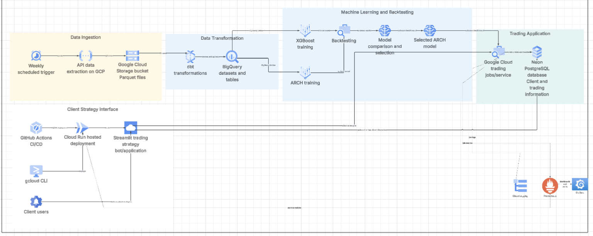

# Crypto Trading Bot — Pipeline ELT, Modélisation ML & Déploiement Cloud

Bot de trading algorithmique pour crypto-monnaies, articulé autour d'une architecture GCP complète : ingestion des données de marché, transformation (ELT), modélisation prédictive (ML + économétrie financière), backtesting, et déploiement d'une application de trading en production.

---

## Sommaire

- [Vue d'ensemble](#vue-densemble)
- [Architecture](#architecture)
- [Stack technique](#stack-technique)
- [Description des modules](#description-des-modules)
  1. [Data Ingestion](#1-data-ingestion)
  2. [Data Transformation](#2-data-transformation)
  3. [Machine Learning & Backtesting](#3-machine-learning--backtesting)
  4. [Trading Application](#4-trading-application)
  5. [Client Strategy Interface](#5-client-strategy-interface)
  6. [Observabilité & Monitoring](#6-observabilité--monitoring)
- [Flux de données](#flux-de-données)
- [CI/CD & Déploiement](#cicd--déploiement)
- [Structure du projet](#structure-du-projet)
- [Prérequis](#prérequis)
- [Installation](#installation)
- [Roadmap](#roadmap)
- [Licence](#licence)

---

## Vue d'ensemble

Ce projet met en œuvre un pipeline de bout en bout pour la génération et l'exécution de stratégies de trading crypto, hébergé entièrement sur **Google Cloud Platform (GCP)** :

1. **Ingestion** hebdomadaire des données de marché via API, stockées au format Parquet.
2. **Transformation** des données brutes en tables analytiques via **dbt** sur **BigQuery**.
3. **Modélisation** combinant machine learning (**XGBoost**) et économétrie financière (modèles **ARCH**), évaluée par **backtesting** systématique.
4. **Sélection automatique** du modèle le plus performant, déployé dans un service de trading en production.
5. **Interface client** sous forme d'application **Streamlit**, déployée sur **Cloud Run** via une chaîne CI/CD complète.
6. **Persistance** des données clients et des opérations de trading dans une base **PostgreSQL (Neon)**.
7. **Observabilité** via Cloud Logging, Prometheus et Grafana.

---

## Architecture

Le schéma ci-dessous synthétise l'ensemble du pipeline, de l'ingestion des données jusqu'à l'interface utilisateur en production.




---

## Stack technique

| Domaine | Technologies |
|---|---|
| Cloud Provider | Google Cloud Platform (GCP) |
| Stockage brut | Google Cloud Storage (Parquet) |
| Entrepôt de données | BigQuery |
| Transformation de données | dbt |
| Machine Learning | XGBoost |
| Modélisation économétrique | ARCH (volatilité) |
| Backtesting | Framework interne de backtesting |
| Base de données applicative | PostgreSQL (Neon) |
| Application / Bot de trading | Python, Cloud Run |
| Interface utilisateur | Streamlit |
| CI/CD | GitHub Actions, gcloud CLI |
| Orchestration | Cloud Scheduler (déclenchement hebdomadaire) |
| Monitoring & Logs | Cloud Logging, Prometheus, Grafana |

---

## Description des modules

### 1. Data Ingestion

- **Weekly scheduled trigger** : déclenchement automatique hebdomadaire (Cloud Scheduler) de la collecte des données de marché.
- **API data extraction on GCP** : extraction des données depuis une ou plusieurs API de marché crypto.
- **Google Cloud Storage bucket (Parquet files)** : stockage des données brutes au format Parquet, servant de zone de dépôt (landing zone) avant transformation.

### 2. Data Transformation

- **dbt transformations** : nettoyage, normalisation et enrichissement des données via des modèles dbt versionnés.
- **BigQuery datasets and tables** : matérialisation des tables analytiques prêtes à être consommées par les modules de modélisation.

### 3. Machine Learning & Backtesting

- **XGBoost training** : entraînement d'un modèle de machine learning supervisé pour la prédiction de signaux/directions de marché.
- **ARCH training** : entraînement d'un modèle économétrique de type ARCH pour la modélisation de la volatilité conditionnelle.
- **Backtesting** : évaluation historique des deux approches sur des données out-of-sample.
- **Model comparison and selection** : comparaison des performances (métriques de rendement, de risque, de drawdown, etc.) et sélection du modèle optimal.
- **Selected ARCH model** *(ou XGBoost selon le résultat)* : modèle final retenu et transmis à l'application de trading.

### 4. Trading Application

- **Google Cloud trading jobs/service** : service GCP exécutant la stratégie de trading en production à partir du modèle sélectionné.
- **Neon PostgreSQL database** : base de données hébergeant les informations clients et l'historique des opérations de trading.

### 5. Client Strategy Interface

- **GitHub Actions CI/CD** : pipeline d'intégration et de déploiement continu.
- **gcloud CLI** : déploiement manuel/scripté complémentaire vers GCP.
- **Cloud Run hosted deployment** : hébergement conteneurisé, scalable et serverless de l'application.
- **Streamlit trading strategy bot/application** : interface web permettant aux **clients utilisateurs** de suivre et piloter leur stratégie de trading.

### 6. Observabilité & Monitoring

- **Cloud Logging** : centralisation des logs applicatifs et d'infrastructure.
- **Prometheus** : collecte de métriques applicatives et système.
- **Grafana** : visualisation et alerting sur les métriques collectées.

---

## Flux de données

```
[Cloud Scheduler]
      │ trigger hebdomadaire
      ▼
[API Market Data] → [GCS Bucket - Parquet]
      │
      ▼
[dbt] → [BigQuery]
      │
      ├────────────► [XGBoost Training] ─┐
      │                                   ├──► [Backtesting] ──► [Model Selection]
      └────────────► [ARCH Training]  ───┘                             │
                                                                        ▼
                                                          [Trading Service - Cloud Run]
                                                                        │
                                                                        ▼
                                                          [Neon PostgreSQL DB]
                                                                        │
                                                                        ▼
                                                    [Streamlit App] ◄── [Client Users]
```

---

## CI/CD & Déploiement

1. Push sur la branche principale → déclenchement de **GitHub Actions**.
2. Build & tests automatisés.
3. Déploiement de l'image conteneurisée sur **Cloud Run** (via `gcloud CLI` ou action GitHub dédiée).
4. Mise à disposition de l'application **Streamlit** aux utilisateurs finaux.

---

## Structure du projet

```
.
├── ingestion/              # Scripts d'extraction API → GCS (Parquet)
├── transformation/         # Modèles dbt
├── modeling/
│   ├── xgboost/            # Entraînement et sérialisation du modèle XGBoost
│   └── arch/                # Entraînement du modèle ARCH
├── backtesting/            # Framework et résultats de backtesting
├── trading_service/        # Service de trading (Cloud Run)
├── app/                    # Application Streamlit (interface client)
├── infra/                  # IaC / scripts gcloud
├── .github/workflows/      # Pipelines CI/CD GitHub Actions
├── docs/
│   └── architecture.png
└── README.md
```

---

## Prérequis

- Compte **GCP** avec les APIs suivantes activées : Cloud Storage, BigQuery, Cloud Run, Cloud Scheduler, Cloud Logging.
- **Python 3.10+**
- **dbt-core** et l'adaptateur `dbt-bigquery`
- **gcloud CLI** configuré et authentifié
- Base **Neon PostgreSQL** provisionnée
- Compte de service GCP avec les droits IAM nécessaires

---

## Installation

```bash
# Cloner le dépôt
git clone <repo_url>
cd <repo_name>

# Créer un environnement virtuel
python -m venv venv
source venv/bin/activate

# Installer les dépendances
pip install -r requirements.txt

# Authentification GCP
gcloud auth login
gcloud config set project <PROJECT_ID>

# Lancer les transformations dbt
cd transformation
dbt run

# Lancer l'application Streamlit en local
streamlit run app/main.py
```

---

## Roadmap

- [ ] Ajout de modèles de marché supplémentaires (LSTM, Prophet, etc.)
- [ ] Automatisation complète du re-entraînement des modèles
- [ ] Alerting avancé via Grafana (Slack/Email)
- [ ] Tests de charge sur le service de trading
- [ ] Support multi-exchange

---

## Licence

Ce projet est distribué sous licence propriétaire. Tous droits réservés, sauf mention contraire.

---

**Auteur** : *Epiphane Egah*
**Contact** : *egahepiphane@gmail.com*